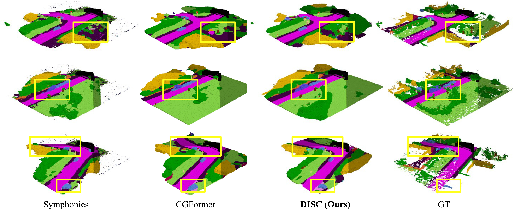
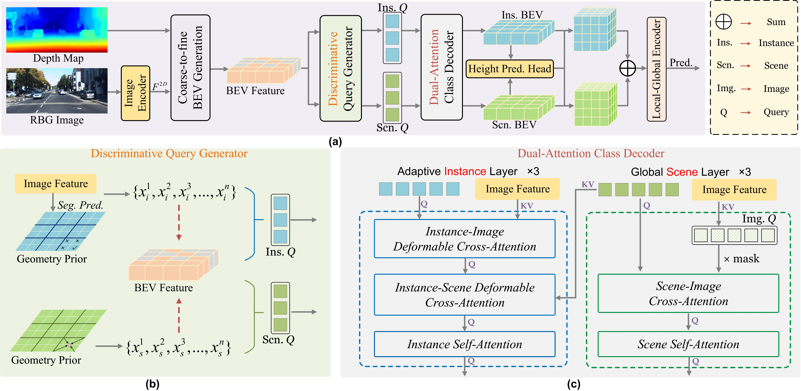
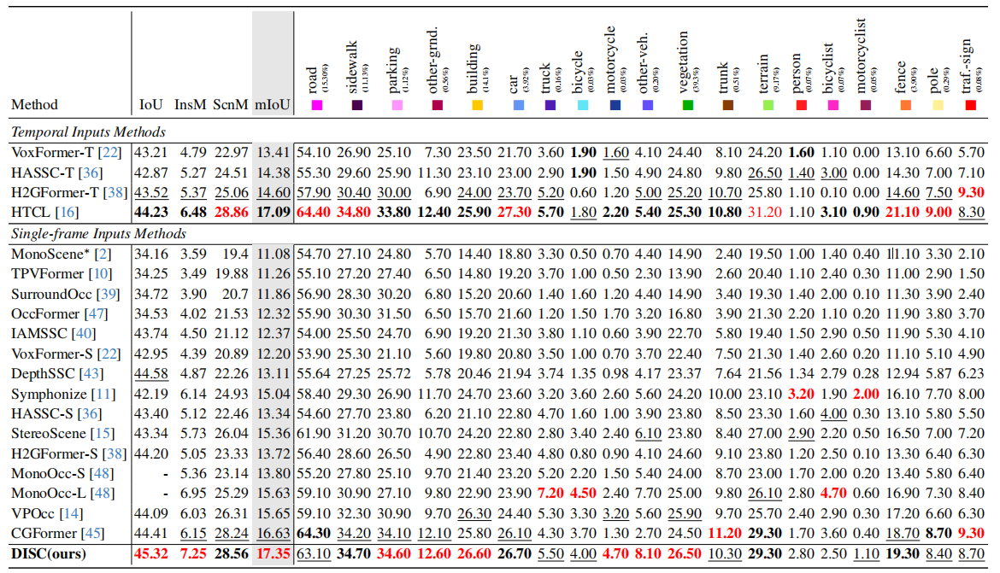
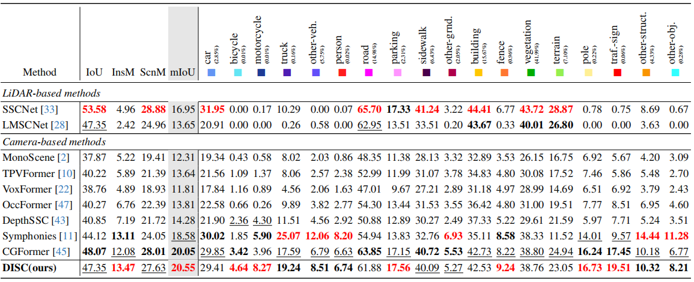

# Disentangling Instance and Scene Contexts for 3D Semantic Scene Completion



## 🚀 News

- **2025.7.15** code released
- **2025.7.15** [**arXiv**](http://arxiv.org/abs/2507.08555) preprint released
- **2025.6.26** accepted by ICCV 2025

## 📖 Introduction

3D Semantic Scene Completion (SSC) has gained increasing attention due to its pivotal role in 3D perception. Recent advancements have primarily focused on refining voxel-level features to construct 3D scenes. However, treating voxels as the basic interaction units inherently limits the utilization of class-level information, which is proven critical for enhancing the granularity of completion results. To address this, we propose **D**isentangling **I**nstance and **S**cene **C**ontexts (**DISC**), a novel dual-stream paradigm that enhances learning for both instance and scene categories through separated optimization. Specifically, we replace voxel queries with discriminative class queries, which incorporate class-specific geometric and semantic priors. Additionally, we exploit the intrinsic properties of classes to design specialized decoding modules, facilitating targeted interactions and efficient class-level information flow. Experimental results demonstrate that DISC achieves state-of-the-art (SOTA) performance on both SemanticKITTI and SSCBench-KITTI-360 benchmarks, with mIoU scores of 17.35 and 20.55, respectively. Remarkably, DISC even outperforms multi-frame SOTA methods using only single-frame input and significantly improves instance category performance, surpassing both single-frame and multi-frame SOTA instance mIoU by **17.9%** and **11.9%**, respectively, on the SemanticKITTI hidden test.

## ⚙️ Method



**The overall architecture.** (a) DISC is a novel semantic scene completion method with a dual-stream framework for specialized instance and scene categories processing. (b) The Discriminative Query Generator (DQI) integrates geometric and contextual priors into instance and scene queries based on category attributes. (c) Details of the Adaptive Instance Layer (AIL) and the Global Scene Layer (GSL), which address the distinct challenges faced by instance and scene categories during the reconstruction process in a differentiated manner. For clarity, the Feed-Forward Network (FFN) and positional embedding are omitted in the figure.

## 📊 Quantitative Results



Table 1. **Quantitative results on SemanticKITTI test**.  Among all methods, the top three ranked approaches are marked as <font color=red>**red**</font>, **bold**, and <u>underlined</u>. For single-frame methods, DISC achieves SOTA performance in mIoU, IoU, InsM, and ScnM. Notably, using only single-frame input, DISC surpasses even multi-frame SOTA methods in mIoU, IoU, and InsM.



Table 2. **Quantitative results on SSCBench-KITTI360 test**. Among all methods, the top three ranked approaches are marked as <font color=red>**red**</font>, **bold**, and <u>underlined</u>. DISC achieves SOTA results in mIoU and InsM, while surpassing LiDAR-based methods across multiple category-specific metrics.

## 🏃‍♂️ Getting Started

### Step 1. Installation

1. Create conda environment
```bash
conda create -n disc python=3.8
conda activate disc
```

2. Install CUDA inside conda environment
```bash
conda install -c "nvidia/label/cuda-11.8.0" cuda
```

3. Install PyTorch
```bash
pip install torch==2.0.0 torchvision==0.15.1 torchaudio==2.0.1 --index-url https://download.pytorch.org/whl/cu118
```

4. Install MMCV, MMDetection etc
```bash
pip install mmcv==2.0.1 -f https://download.openmmlab.com/mmcv/dist/cu118/torch2.0/index.html
pip install mmdet==3.0.0 mmdet3d==1.1.1
```

5. Install version-specific packages
```bash
pip install "natten==0.14.6+torch200cu118" -f https://shi-labs.com/natten/wheels/ --trusted-host shi-labs.com
pip install torch-scatter -f https://data.pyg.org/whl/torch-2.0.0+cu118.html
```

6. Install other requirements
```bash
pip install -r requirements.txt
```

7. Compile BEV operations generates ``build`` folder. To ensure this executed correctly, check if ``ssc_ia/models/bevpipelines/BEVFusion/bevfusion/ops/bev_pool/bev_pool_ext.cpython-38-x86_64-linux-gnu.so`` and ``ssc_ia/models/bevpipelines/BEVFusion/bevfusion/ops/voxel/voxel_layer.cpython-38-x86_64-linux-gnu.so`` have been generated.
```bash
python ssc_ia/models/bevpipelines/BEVFusion/setup.py build_ext --inplace
```

8. Download the pre-trained models of maskdino and swin, and place them in the pretrain folder.

### Step 2. Dataset Preparation

Please refer to [Symphonies](https://github.com/hustvl/Symphonies) to complete the preparation of SemanticKitti and Kitti-360 datasets. Also, modify the corresponding path configurations in configs/datasets.

```bash
mkdir data
ln -s /path/to/KITTI-360-low data/
```

**Gaze files**

```bash
mkdir gaze_dir
ln -s driver-gaze-yolov5/outputs/2d_heatmaps/KITTI-360-low/data_2d_raw gaze_dir/
```

In `ssc_ia/data/datasets/kitti_360.py`, edit variable ``GAZE_DIR``


### Step 3. Training and Inference

1. **Setup**

   Refer to `run.sh`, we set the ``use_gaze`` flag again the commands.

   ```bash
   export PYTHONPATH=`pwd`:$PYTHONPATH
   export LD_LIBRARY_PATH=/home/schischk/miniconda3/envs/disc/lib:$LD_LIBRARY_PATH
   ```

2. **Training**

   ```bash
   python tools/train.py use_gaze=True
   ```

3. **Validation**
   ```bash
   python tools/train.py use_gaze=True resume.ckpt_path=/path/to/ckpt validate=true
   ```

4. **Testing**

   Generate the ``.label`` outputs  in the ``outputs/KITTI360/labels`` folder (sample provided) for submission on the evaluation server

   ```bash
   python tools/test.py use_gaze=True
   ```

5. **Visualization**

    1. Generating outputs in the ``outputs/KITTI360/predictions`` folder (sample provided)

        ```shell
        python tools/generate_outputs.py
        ```

    2. Visualization in the ``outputs/visualizations`` folder (sample provided)

        ```shell
        python tools/visualize.py
        ```
        In case of running on remote server without a monitor
        
        ```bash
        QT_QPA_PLATFORM=offscreen python tools/visualize.py
        ```

## 🏆 Model Zoo

We provide the pretrained weights on SemanticKITTI and KITTI360 datasets, reproduced with the released codebase.

|                      Dataset                       |   IoU   |   mIoU   |                        Model Weights                         |                        Output Log                         |
| :------------------------------------------------: | :-----: | :------: | :----------------------------------------------------------: | :-------------------------------------------------------: |
| [SemanticKITTI](configs/config_sema.yaml) | 45.32   | 17.35    | [Link](https://github.com/Enyu-Liu/DISC/releases/download/v1.0.0/DISC_SemanticKitti.ckpt) | [Log](https://github.com/Enyu-Liu/DISC/releases/download/v1.0.0/stdout.txt) |
|   [KITTI360](configs/config_360.yaml)    | 47.35   | 20.55    | [Link](https://github.com/Enyu-Liu/DISC/releases/download/v1.0.0/DISC_KITTI360.ckpt)      | -      |

## 🌟 Acknowledgement

We extend our sincere gratitude to these outstanding open source projects:
- [Driver gaze estimation on KITTI360](https://github.com/SebastianJames55/driver-gaze-yolov5)
- [Symphonize](https://github.com/hustvl/Symphonies.git)
- [CGFormer](https://github.com/pkqbajng/CGFormer)
- [mmdet3d](https://github.com/open-mmlab/mmdetection3d)
- [VoxFormer](https://github.com/NVlabs/VoxFormer)
- [FlashOCC](https://github.com/Yzichen/FlashOCC)
- [MonoScene](https://github.com/astra-vision/MonoScene)
- [LSS](https://github.com/nv-tlabs/lift-splat-shoot)

Since it is difficult to include every referenced project, please let us know if your repository is missing from the list, and we will update it accordingly.

## 📄 Citation

If you find our work beneficial for your research, please consider citing our paper and give us a star:

```
@misc{liu2025disentanglinginstancescenecontexts,
      title={Disentangling Instance and Scene Contexts for 3D Semantic Scene Completion}, 
      author={Enyu Liu and En Yu and Sijia Chen and Wenbing Tao},
      year={2025},
      eprint={2507.08555},
      archivePrefix={arXiv},
      primaryClass={cs.CV},
      url={https://arxiv.org/abs/2507.08555}, 
}
```
